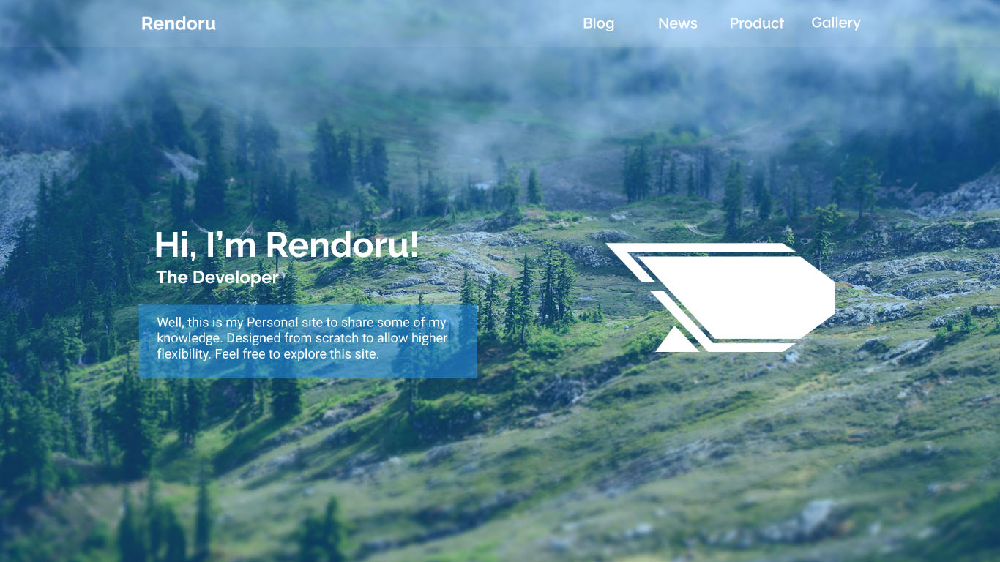
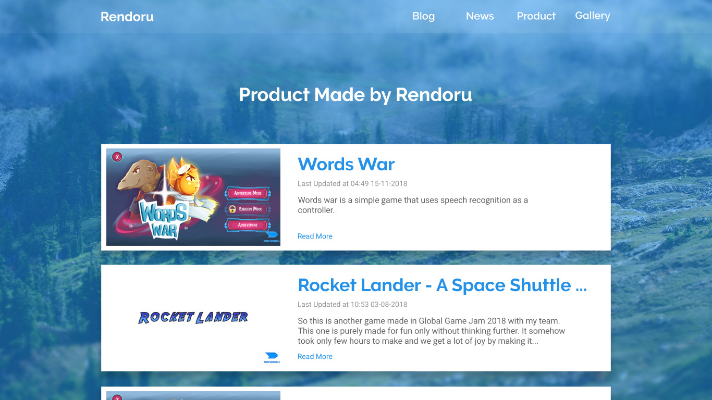
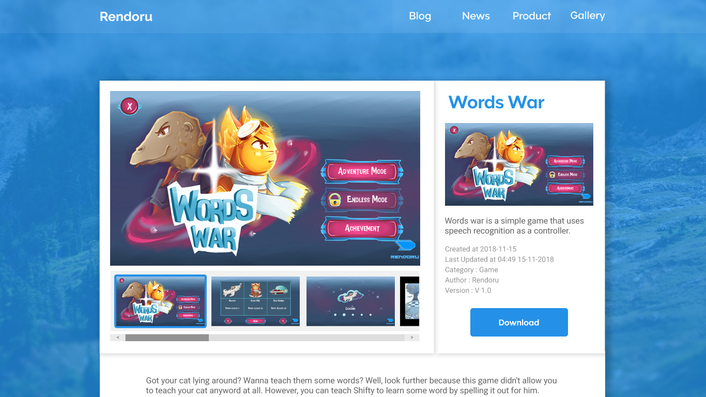

# Usability Evaluation and Prototyping (again)
> Usability Evaluation in this assignment is to evaluate your high-fidelity interactive-prototype with two participants:
> the participant from the previous Contextual Inquiry (CI) 
> and an additional novice-participant with different demographics if possible.
> Respectively, revise your prototype as an attempt to fix any problems found in this Usability Evaluation.

## Operating the Prototype
> Record a video (screen-recording is preferred) while you operating your prototype.
> Present the ideal case on how to interact with the prototype from the beginning to the end.
> Upload the video on any video-sharing website (e.g., YouTube), then attach the video link on this report.

---

## Part A: Usability Evaluation
> In this part, you should prepare your high-fidelity interactive-prototype from the assignment 2.
> Invite the participant from your previous CI to test the prototype.
> You also need to invite one more novice participant.
> As with the CI, you might need to videotape your sessions.
> You can benefit from the videotape while writing your `Recording Transcript` later.

### 1. Brief Description of Participants
> Describe your participants in bullets or sentences.
> The description should contain their demographic (age, gender, occupation),
> their skill level in using the system, and your reasons choosing them.
> The description should NOT contain any personally identifiable information.

#### a. Description of Participant 1
 - A girl, 21 years old
 - College Student
 - Use internet for browsing and doing assignment
 - Previous CI participant

#### b. Description of Participant 2
 - A man, about 31 years old
 - Businness man
 - Using the internet mainly for chat with his businness partners
 
### 2. Evaluation Script

- Open product page
- Open Words War
- View the second last picture
- View the last picture
- Open the last picture
- View previous picture
- Back to homepage

### 3. Transcript

#### a. Transcript with Participant 1
1. **Me** : pertama, buka halaman product
1. **🙋‍♀️** : (she clicked on "Product" menu)
1. **Me** : buka words war
1. **🙋‍♀️** : (she clicked on "Words War" product)
1. **Me** : terus, lihat gambar nomor dua dari terakhir
1. **🙋‍♀️** : (she was little confused by how the scrolling works)
1. **🙋‍♀️** : (she clicked on second last picture) iki? terus?
1. **Me** : lihat gambar terakhir
1. **🙋‍♀️** : (she clicked on the last picture)
1. **Me** : terus, perbesar gambar terakhir
1. **🙋‍♀️** : (participants had difficulty doing this instruction)
1. **🙋‍♀️** : (after few minutes, she clicked on main picture)
1. **Me** : Nah itu
1. **Me** : terus, lihat gambar sebelumnya
1. **🙋‍♀️** : (she clicked on the previous button)
1. **Me** : close popup nya
1. **🙋‍♀️** : (she clicked on the close button)
1. **Me** : kembali ke halaman utama
1. **🙋‍♀️** : (she clicked on the "Rendoru" menu)
1. **Me** : oke, selesai

#### b. Transcript with Participant 2
 - **00:01** 👨‍🔬 You: Lorem Ipsum is simply dummy text of the printing and typesetting industry.
 - **00:10** 👨‍💻 Participant: Lorem Ipsum has been the industry's standard dummy text ever since the 1500s.
 - **00:17** 👨‍🔬 You: when an unknown printer took a galley of type and scrambled it to make a type specimen book.
 - **00:25** 👨‍💻 Participant: The Quick Brown Fox Jumps Over The Lazy Dog.

### 4. Feedback and Incidence Analysis

#### OBSERVATION 1

 - **Reference**: Provide line-number(s) or time-code(s) referred by feedback/incidence observed on the screen.
 - **Feedback**: Provide feedback (positive or negative) given by the participants, if any.
 - **Incidence**: Critical incidences (breakdowns or problems encountered by the participants) and/or mistakes committed by the participants, if any.
 - **Reason**: Explain the reason for the breakdowns or the negative feedback observed on the screen.
 - **Resolution**: Suggest any modifications that might be made to the UI to address the issues in this `OBSERVATION 1`.
 
#### OBSERVATION 2

 - **Reference**: 
 - **Feedback**: 
 - **Incidence**: 
 - **Reason**: 
 - **Resolution**: Suggest any modifications that might be made to the UI to address the issues in this `OBSERVATION 2`.
 
#### OBSERVATION 3

 - **Reference**:  
 - **Feedback**: 
 - **Incidence**: 
 - **Reason**: 
 - **Resolution**: Suggest any modifications that might be made to the UI to address the issues in this `OBSERVATION 3`.
 
 ... and so on ...
 
 ---

## Part B: Prototyping (again)
> Next, you will need to modify your prototype 
> based on the resolutions you have suggested in `Feedback and Incidence Analysis`'s observations.

### Sketch
> Draw a sketch of your prototype that is refined based according to the aforementioned observations on a paper.
> Afterwards, scan the sketch or make the photograph of it and attach it on this report's section.
> Please make sure the any texts on the sketch are readable.

### Design Rationale
> Please write a paragraph expressing what you have learned from the usability evaluation, 
> and how it is reflected in your design.

### High-Fidelity Interactive-Prototype
> Create a high-fidelity interactive-prototype based on the `Sketch` you have drawn.
> You can use any prototyping tools: InVision, Adobe XD, or even Microsoft PowerPoint.
