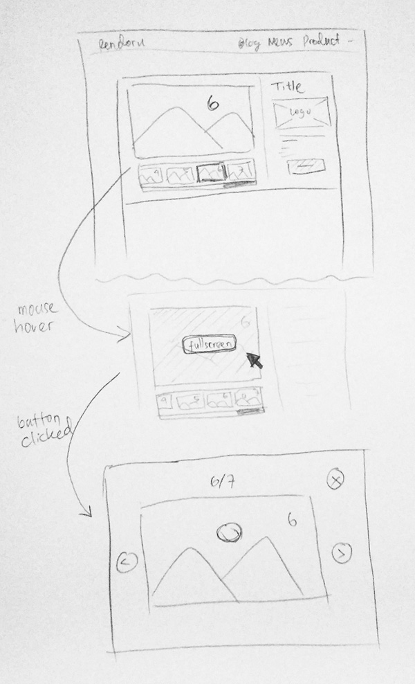

# Usability Evaluation and Prototyping (again)

## Operating the Prototype

---

## Part A: Usability Evaluation

### 1. Brief Description of Participants

#### a. Description of Participant 1
 - A girl, 21 years old
 - College Student
 - Use internet for browsing and doing assignment
 - Previous CI participant

#### b. Description of Participant 2
 - A man, about 31 years old
 - Businness man
 - Using the internet mainly for chat with his businness partners
 
### 2. Evaluation Script

- Open product page
- Open Words War
- View the second last picture
- View the last picture
- Open(Full Screen) the last picture
- View previous picture
- Back to homepage

### 3. Transcript

#### a. Transcript with Participant 1
1. **Me** : pertama, buka halaman product
1. **🙋‍♀️** : (she clicked on "Product" menu)
1. **Me** : buka words war
1. **🙋‍♀️** : (she clicked on "Words War" product)
1. **Me** : terus, lihat gambar nomor dua dari terakhir
1. **🙋‍♀️** : (she was little confused by how the scrolling works)
1. **🙋‍♀️** : (she clicked on second last picture) iki? terus?
1. **Me** : lihat gambar terakhir
1. **🙋‍♀️** : (she clicked on the last picture)
1. **Me** : terus, perbesar gambar terakhir
1. **🙋‍♀️** : (participants had difficulty doing this instruction)
1. **🙋‍♀️** : (after few minutes, she clicked on main picture)
1. **Me** : Nah itu
1. **Me** : terus, lihat gambar sebelumnya
1. **🙋‍♀️** : (she clicked on the previous button)
1. **Me** : close popup nya
1. **🙋‍♀️** : (she clicked on the close button)
1. **Me** : kembali ke halaman utama
1. **🙋‍♀️** : (she clicked on the "Rendoru" menu)
1. **Me** : oke, selesai

#### b. Transcript with Participant 2
1. **Me** : selamat malam pak, langsung saja kita mulai
1. **Me** : coba buka halaman produk
1. 👨‍💻 : ini gabisa digeser ya pak?
1. **Me** : iya pak enggak bisa, ini cuma desain saja
1. 👨‍💻 : (mencet link "rendoru" (homepage))
1. 👨‍💻 : ini tadi kenapa ya?
1. **Me** : ini menu home pak jadi ngereload halaman sekarang gitu
1. 👨‍💻 : (mencet menu "product")
1. 👨‍💻 : ooh ini
1. **Me** : disini kan ada daftar" produk dari website ini, terus coba bapak buka yg words ward.
1. 👨‍💻 : (mencet words war) words waar
1. **Me** : nah iya pak, berhasil ya pak
1. **Me** : terus...
1. 👨‍💻 : (mencet-mencet tombol 'Download')
1. **Me** : belum bisa itu pak tombolnya.
1. 👨‍💻 : ooh iya iya, bagus kok
1. **Me** : jadi ini ada yang merah-merah ini nanti buat geser-geser gambarnya pak, kalau di web kan kita bisa 1. scroll pake mouse
1. 👨‍💻 : ooh iya gituu
1. **Me** : nah sekarang coba bapak buka gambar yang kedua dari terakhir
1. 👨‍💻 : sebelum terakhiir...
1. 👨‍💻 : (mencet kanan scrollbar *menggeser)
1. 👨‍💻 : (mencet gambar yang diminta)
1. **Me** : terus buka gambar yang terakhir
1. 👨‍💻 : (mencet gambar terakhir)
1. **Me** : bisa ya pak?
1. 👨‍💻 : bisa bisa
1. **Me** : terus coba buka yang terakhir lagi pak.
1. 👨‍💻 : (mencet gambar terakhir)
1. **Me** : terus coba perbesar gambarnya, yang terakhir pak.
1. 👨‍💻 : (mencoba mencet-mencet scrollbar *menggeser)
1. 👨‍💻 : (mencet gambar sebelumnya)
1. 👨‍💻 : (tidak sengaja(?) mencet gambar yang besar, dan muncul popup gambar besar)
1. **Me** : nah, besar itu pak. tapi itu yang gambar sebelumnya. coba di close dulu pak.
1. 👨‍💻 : (mencet tombol close)
1. 👨‍💻 : (mencet gambar terakhir, mencet gambar supaya fullscreen)
1. **Me** : nah itu.
1. **Me** : menurut bapak, kendalanya apa
1. 👨‍💻 : saya bingung mas, gak tau kalau ini bisa diklik buat memperbesar kayak gini.
1. **Me** : jadi menurut bapak bagaimana pak?
1. 👨‍💻 : mungkin dikasih tanda mas, biar tau saja kalo ini bisa munculin gambar yang besar ini.
1. **Me** : dikasih tombol gitu pak, bisa di klik?
1. 👨‍💻 : ya gitu boleh, bisa bisa.
1. **Me** : yaudah pak, sekarang coba kembali ke halaman utama
1. 👨‍💻 : (mencet menu 'Rendoru')
1. **Me** : iyaa, udah selesai pak. jadi begitu saja. terimakasih ya pak.
1. 👨‍💻 : iya iya

### 4. Feedback and Incidence Analysis
 
#### OBSERVATION 1

 - **Reference**: Participant 1 (11), Participant 2 (30-32)
 - **Feedback**: Negative
 - **Incidence**: Participant can't figure how to do my instruction about opening the image in fullscreen
 - **Reason**: there is no specific marker that the part can be clicked on
 - **Resolution**: Add the 'fullscreen' button while hovering the main image.
 
 ---

## Part B: Prototyping (again)

### Sketch

### Design Rationale
It's important to mark something clearly, I put the fullscreen button in the middle of the picture when user hovering cursor to that picture. So, the user will not feel confused and immediately understand how that component works

### High-Fidelity Interactive-Prototype

[Hi-Fi Prototype](image/prototype.pptx)
