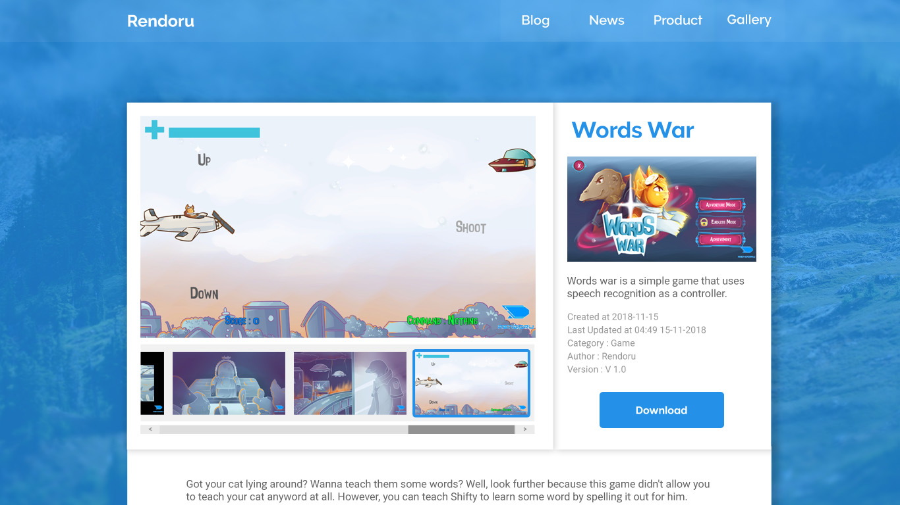

# Usability Evaluation and Prototyping (again)

## Operating the Prototype

---

## Part A: Usability Evaluation

### 1. Brief Description of Participants

#### a. Description of Participant 1
 - A girl, 21 years old
 - College Student
 - Use internet for browsing and doing assignment
 - Previous CI participant

#### b. Description of Participant 2
 - A man, about 31 years old
 - Businness man
 - Using the internet mainly for chat with his businness partners
 
### 2. Evaluation Script

- Open product page
- Open Words War
- View the second last picture
- View the last picture
- Open the last picture
- View previous picture
- Back to homepage

### 3. Transcript

#### a. Transcript with Participant 1
1. **Me** : pertama, buka halaman product
1. **🙋‍♀️** : (she clicked on "Product" menu)
1. **Me** : buka words war
1. **🙋‍♀️** : (she clicked on "Words War" product)
1. **Me** : terus, lihat gambar nomor dua dari terakhir
1. **🙋‍♀️** : (she was little confused by how the scrolling works)
1. **🙋‍♀️** : (she clicked on second last picture) iki? terus?
1. **Me** : lihat gambar terakhir
1. **🙋‍♀️** : (she clicked on the last picture)
1. **Me** : terus, perbesar gambar terakhir
1. **🙋‍♀️** : (participants had difficulty doing this instruction)
1. **🙋‍♀️** : (after few minutes, she clicked on main picture)
1. **Me** : Nah itu
1. **Me** : terus, lihat gambar sebelumnya
1. **🙋‍♀️** : (she clicked on the previous button)
1. **Me** : close popup nya
1. **🙋‍♀️** : (she clicked on the close button)
1. **Me** : kembali ke halaman utama
1. **🙋‍♀️** : (she clicked on the "Rendoru" menu)
1. **Me** : oke, selesai

#### b. Transcript with Participant 2
 - **00:01** 👨‍🔬 You: Lorem Ipsum is simply dummy text of the printing and typesetting industry.
 - **00:10** 👨‍💻 Participant: Lorem Ipsum has been the industry's standard dummy text ever since the 1500s.
 - **00:17** 👨‍🔬 You: when an unknown printer took a galley of type and scrambled it to make a type specimen book.
 - **00:25** 👨‍💻 Participant: The Quick Brown Fox Jumps Over The Lazy Dog.

### 4. Feedback and Incidence Analysis

#### OBSERVATION 1

 - **Reference**: Provide line-number(s) or time-code(s) referred by feedback/incidence observed on the screen.
 - **Feedback**: Provide feedback (positive or negative) given by the participants, if any.
 - **Incidence**: Critical incidences (breakdowns or problems encountered by the participants) and/or mistakes committed by the participants, if any.
 - **Reason**: Explain the reason for the breakdowns or the negative feedback observed on the screen.
 - **Resolution**: Suggest any modifications that might be made to the UI to address the issues in this `OBSERVATION 1`.
 
#### OBSERVATION 2

 - **Reference**: 
 - **Feedback**: 
 - **Incidence**: 
 - **Reason**: 
 - **Resolution**: Suggest any modifications that might be made to the UI to address the issues in this `OBSERVATION 2`.
 
 ---

## Part B: Prototyping (again)

### Sketch

### Design Rationale
`Coming soon`

### High-Fidelity Interactive-Prototype

`Coming soon`
